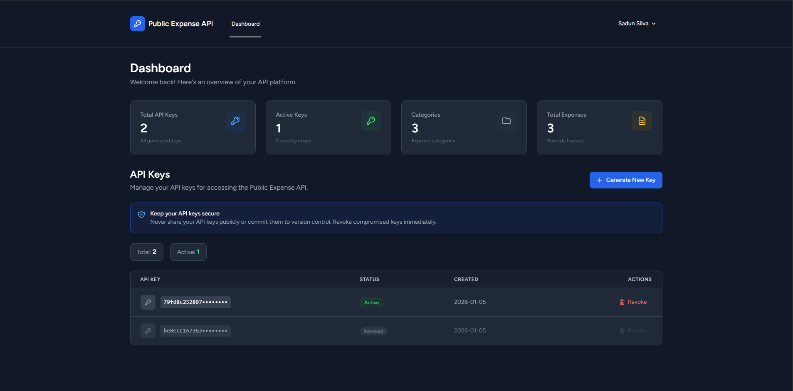

# Public Expense API - Laravel Backend

A RESTful API for expense tracking with API key authentication, built with Laravel 11.

## 🏗️ Architecture Overview

### Technology Stack
- **Framework**: Laravel 11
- **Database**: MySQL 8.0
- **Authentication**: Custom API Key Middleware
- **Testing**: Pest PHP
- **UI**: Laravel Breeze (Blade templates)

### Database Schema

#### Users Table
```sql
- id (primary key)
- name
- email (unique)
- password
- created_at
- updated_at
```

#### API Keys Table
```sql
- id (primary key)
- user_id (foreign key → users.id)
- key (hashed, unique)
- is_active (boolean)
- created_at
- updated_at
```

#### Categories Table
```sql
- id (primary key)
- user_id 
- name
- description (nullable)
- created_at
- updated_at
```

#### Expenses Table
```sql
- id (primary key)
- user_id 
- category_id (foreign key → categories.id)
- amount (decimal)
- expense_date (date)
- description (nullable, text)
- created_at
- updated_at
```

### Architecture Patterns

**MVC Pattern**:
- **Models**: Database entities and business logic
- **Controllers**: Handle HTTP requests and responses
- **Views**: Blade templates for dashboard

**Middleware Authentication**:
- Custom `ApiKeyMiddleware` validates `X-API-KEY` header
- Hashed keys stored in database (SHA-256)
- Active/inactive key status

**RESTful API Design**:
- Standard HTTP methods (GET, POST, PUT, DELETE)
- JSON request/response format
- Consistent endpoint structure

## Application Screen Shots

#### **Landing Page**


#### **Login Page**


#### **Register Page**


#### **Dashboard**



## 🔑 API Key Usage

### How API Keys Work

1. **Generation**: User generates key via dashboard
2. **Storage**: Key is hashed (SHA-256) and stored in database
3. **Authentication**: Client sends key in `X-API-KEY` header
4. **Validation**: Middleware verifies hash matches active key

### Generating API Keys

#### Via Web Dashboard

1. Navigate to `http://127.0.0.1:8000/dashboard`
2. Log in with your credentials
3. Click **"Generate New API Key"**
4. Copy the displayed key (format: `pk_live_xxxxxxxxxxxxxx`)
5. ⚠️ Save it securely - it won't be shown again


### Using API Keys

**Request Header**:
```http
X-API-KEY: pk_live_your_api_key_here
```

**Example with cURL**:
```bash
curl -X GET http://127.0.0.1:8000/api/categories \
  -H "X-API-KEY: pk_live_abc123xyz789" \
  -H "Accept: application/json"
```

**Example with JavaScript**:
```javascript
fetch('http://127.0.0.1:8000/api/categories', {
  headers: {
    'X-API-KEY': 'pk_live_abc123xyz789',
    'Accept': 'application/json'
  }
})
```

### Key Management

**List All Keys**:
```bash
php artisan tinker
App\Models\ApiKey::where('user_id', 1)->get();
```

**Revoke Key**:
```bash
php artisan tinker
App\Models\ApiKey::where('id', 1)->update(['is_active' => false]);
```

## 🚀 Setup Steps

### Prerequisites
- PHP 8.2 or higher
- Composer
- MySQL 8.0 or higher
- Node.js & npm (for frontend assets)

### Installation

1. **Clone and navigate to directory**
```bash
cd public_expense_api
```

2. **Install PHP dependencies**
```bash
composer install
```

3. **Install Node dependencies**
```bash
npm install
```

4. **Environment setup**
```bash
# Copy environment file
cp .env.example .env

# Generate application key
php artisan key:generate
```

5. **Configure database**

Edit `.env`:
```env
DB_CONNECTION=mysql
DB_HOST=127.0.0.1
DB_PORT=3306
DB_DATABASE=expense_api
DB_USERNAME=root
DB_PASSWORD=your_password
```

6. **Create database**
```bash
# MySQL command line
mysql -u root -p
CREATE DATABASE expense_api;
exit
```

7. **Run migrations**
```bash
php artisan migrate
```

8. **Configure CORS** (for frontend)

Edit `config/cors.php`:
```php
'allowed_origins' => [
    'http://localhost:5173',  // Vite dev server
    'http://localhost:3000',  // Alternative port
],
```

9. **Start development server**
```bash
php artisan serve
```

API available at: `http://127.0.0.1:8000`

### Initial Setup

**Create admin user**:
```bash
php artisan tinker
```

```php
App\Models\User::create([
    'name' => 'Admin User',
    'email' => 'admin@example.com',
    'password' => bcrypt('password123')
]);
exit
```

**Access dashboard**: `http://127.0.0.1:8000/login`

## 📡 Sample API Requests

### Base URL
```
http://127.0.0.1:8000/api
```

### Authentication
All API requests require the `X-API-KEY` header.

---

### Categories Endpoints

#### 1. Get All Categories
```http
GET /api/categories
```

#### 2. Get Single Category
```http
GET /api/categories/{id}
```

#### 3. Create Category
```http
POST /api/categories
```

#### 4. Update Category
```http
PUT /api/categories/{id}
```

#### 5. Delete Category
```http
DELETE /api/categories/{id}
```

---

### Expenses Endpoints

#### 1. Get All Expenses
```http
GET /api/expenses
```

#### 2. Create Expense
```http
POST /api/expenses
```

#### 3. Update Expense
```http
PUT /api/expenses/{id}
```

#### 4. Delete Expense
```http
DELETE /api/expenses/{id}
```

#### 5. Get Expenses by Date Range
```http
GET /api/expenses-range?start_date={start}&end_date={end}
```

### Error Responses

#### Missing API Key (401 Unauthorized)
```json
{
  "message": "API key missing"
}
```

#### Invalid API Key (401 Unauthorized)
```json
{
  "message": "Invalid API key"
}
```

#### Validation Error (422 Unprocessable Entity)
```json
{
  "message": "The amount field is required.",
  "errors": {
    "amount": [
      "The amount field is required."
    ]
  }
}
```

#### Resource Not Found (404 Not Found)
```json
{
  "message": "No query results for model [App\\Models\\Category] 999"
}
```

#### Server Error (500 Internal Server Error)
```json
{
  "message": "Server Error",
  "exception": "..."
}
```

---

## 🧪 Testing

### Run Tests
```bash
# Run all tests
php artisan test

# Run specific test
php artisan test --filter=CategoryTest

# With coverage
php artisan test --coverage
```

### Manual API Testing

**Using Postman**:
1. Import collection (create from examples above)
2. Set environment variable: `API_KEY`
3. Add to headers: `X-API-KEY: {{API_KEY}}`

**Using Insomnia**:
1. Create new request
2. Add header: `X-API-KEY: pk_live_your_key`
3. Set method and URL
4. Send request

## 🔧 Development

### Useful Commands

```bash
# Clear all caches
php artisan optimize:clear

# View routes
php artisan route:list

# Database operations
php artisan migrate:fresh      # Drop all tables and re-run migrations
php artisan migrate:refresh    # Rollback and re-run migrations
php artisan db:seed           # Run seeders

# Queue operations (if using queues)
php artisan queue:work

# Generate IDE helper
php artisan ide-helper:generate
```


## 🔒 Security Best Practices

1. **Never expose API keys** in client-side code
2. **Use HTTPS** in production
3. **Implement rate limiting**
4. **Rotate API keys** regularly
5. **Log API access** for monitoring
6. **Validate all inputs** on server-side
7. **Use environment variables** for sensitive data

## 📄 License

MIT License

## 📞 Support

For issues:
- Check logs: `storage/logs/laravel.log`
- Enable debug mode: `APP_DEBUG=true` in `.env`
- Check database connection
- Verify API key is active
`````
